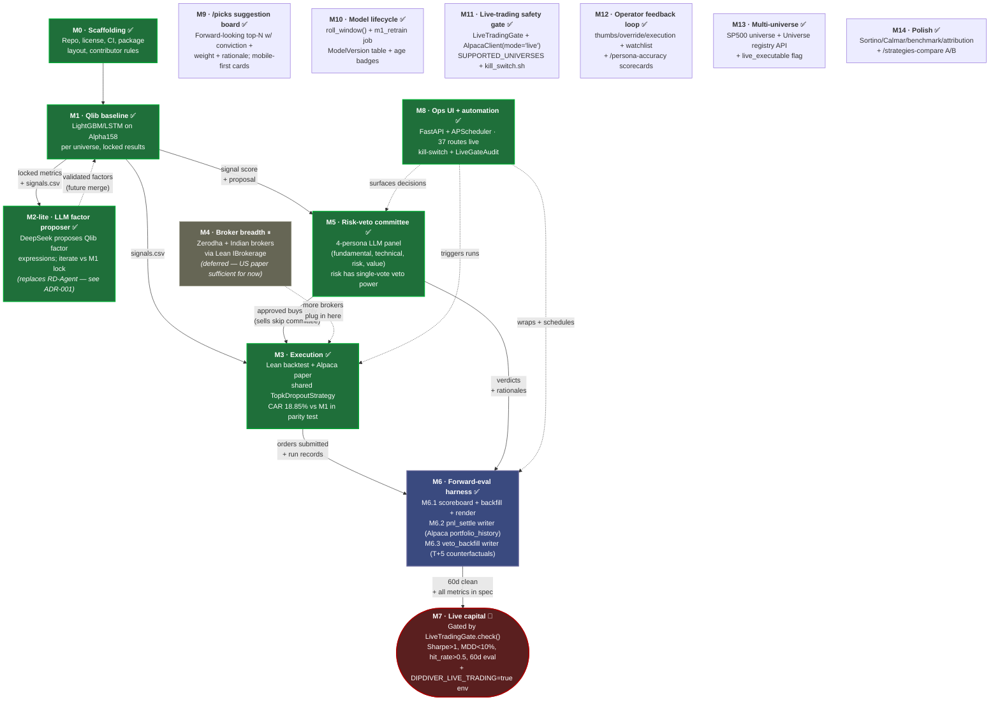

# Roadmap

A ten-week build sequence, ordered so that every milestone produces an artefact that gates the next one. **No milestone is "complete" until its acceptance criteria pass.** A failed acceptance is not a delay — it's a signal to revisit the architecture.

Weeks are nominal. Real elapsed time depends on how hard reproduction goes.

## Pipeline at a glance

Each milestone produces a typed artefact that feeds the next. Status as of 2026-06-06: **M0–M3 + M5 + M6 (all sub-milestones) + M8–M14 shipped**, M2 pivoted from RD-Agent to M2-lite, M4 deferred. M7 (live capital) remains gated on 60+ days of clean paper forward-eval — the gate is now enforced in code via `dipdiver/adapters/alpaca/gate.LiveTradingGate`. See [`IMPLEMENTATION_PLAN.md`](IMPLEMENTATION_PLAN.md) for what M9–M14 mean.

Plain-text fallback (when the diagram doesn't render):

| Stage | What it produces (artefact) | What consumes it |
| ----- | --------------------------- | ---------------- |
| M0 → M1 | Repo + CI + package skeleton | Everything |
| M1 → M2-lite | Locked baseline metrics + `signals.csv` per universe | M2-lite challenges the lock; M3 reads signals.csv |
| M2-lite → M1 | Validated factor expressions (future — currently logged, not merged into M1) | M1 incorporates surviving factors into next training |
| M1 → M3 | `signals.csv` (date, symbol, score) | M3 Lean backtest + Alpaca live runner |
| M1/M2 → M5 | `TradeProposal` (per rotation) | M5 committee reviews buys |
| M5 → M3 | Per-symbol approve/veto + rationale | M3 submits approved buys only |
| M3 + M5 → M6 | Run records JSON (orders + verdicts) | M6 nightly scoreboard |
| M6 → M7 | ≥60 days of green forward-eval | M7 capital-deployment gate |

---

## Milestone 0 · Repo scaffolding (week 0)

**Goal.** A public repo a stranger can read and understand without running anything.

**Tasks.**
- README + docs (this batch).
- LICENSE chosen and committed.
- Directory structure: `dipdiver/{brain,committee,adapters,harness,brokers}/`, `tests/`, `notebooks/`.
- CI: lint, type-check, unit-test skeleton.

**Acceptance.** Repo passes its own CI on an empty commit. Docs render cleanly on GitHub.

---

## Milestone 1 · Qlib baseline (weeks 1–2)

**Goal.** A reproducible, boring baseline. Without this we cannot tell whether anything we add later is helping.

**Tasks.**
- Stand up Qlib with universes: DOW 30 (US equities), Nifty 50 (Indian equities), a small crypto basket (BTC/ETH/SOL).
- Reproduce one Qlib-included LightGBM and one LSTM backtest per universe.
- Lock the data snapshot, store the exact config and seeds.

**Acceptance.**
- Backtest results match Qlib's published numbers within ±5% on the same period.
- Anyone can `make baseline` and reproduce in <1 hour.

**Failure mode.** If Qlib can't be made reproducible, the whole stack is unsafe — fix it here or stop.

---

## Milestone 2 · RD-Agent(Q) reproduction (weeks 3–4)

**Goal.** Reproduce RD-Agent(Q)'s ~2× alpha claim on **our** universe, or find out it doesn't transfer.

**Tasks.**
- Bring up RD-Agent(Q) against the Milestone 1 environment.
- Run the published config (o3 + GPT-4.1) on DOW 30.
- Evaluate cheaper LLM substitutes (Sonnet 4.6, Haiku 4.5, DeepSeek) and record cost/performance trade-off.
- Run on Nifty 50 and crypto basket too — measure transferability.

**Acceptance.**
- On at least one universe, RD-Agent(Q) outperforms the Milestone 1 baseline by a statistically meaningful margin (signed-rank test, p<0.05, on rolling windows).
- Cost per research iteration is documented.

**Failure mode.** If the claim doesn't reproduce on any universe, demote ADR-001's brain to "Qlib + standard models" and revisit. Document the negative result publicly — that itself is valuable.

---

## Milestone 3 · Lean execution chassis (weeks 5–6)

**Goal.** A Qlib-produced portfolio decision can be executed by Lean in backtest, paper, and (eventually) live — and the three produce the same orders.

**Tasks.**
- Write `dipdiver.adapters.lean.PortfolioToInsights`: converts a `PortfolioProposal` into Lean `Insight` objects.
- Run the Milestone 1 baseline through Lean as a Lean backtest. Compare order-by-order with Qlib's internal backtest.
- Wire Alpaca paper account; run the same strategy for 5 trading days.

**Acceptance.**
- **Parity test:** Lean backtest orders match Qlib backtest orders within tolerance (price differences only from intra-bar fill model; instrument/direction/size identical).
- Paper account run matches Lean backtest for the same 5 days within slippage budget.

**Failure mode.** If parity can't be achieved, the whole "backtest validates live" promise is broken. Stop and fix.

---

## Milestone 4 · Broker breadth (week 7)

**Goal.** Indian retail brokers usable through Lean.

**Tasks.**
- Port one FinceptTerminal broker adapter (start with Zerodha) into Lean's `IBrokerage` interface.
- Conformance suite: place, cancel, replace, query order, query positions, query balances — all green against the broker's paper environment.
- Document the porting recipe so the others (Angel One, Upstox, Fyers) are mechanical.

**Acceptance.** Conformance suite passes on Zerodha paper. Porting recipe is one page.

---

## Milestone 5 · Risk-veto committee (week 8)

**Goal.** TradingAgents-style committee runs in front of every Lean order in paper mode.

**Tasks.**
- Port TradingAgents' agent topology; wrap as a service consuming `PortfolioProposal` and emitting `ApprovalDecision`.
- Persona agents from FinceptTerminal (Buffett, Graham, etc.) optionally feed in as opinions.
- Hard-enforce veto-only semantics — committee output cannot increase position size or add instruments.
- Log every debate transcript.

**Acceptance.**
- 100 paper trades pass through the committee. Veto rate is in a sane range (1–30%; 0% or 100% means it's broken).
- Each veto has a logged rationale a human can read.

---

## Milestone 6 · Forward-eval harness (weeks 9–10)

**Goal.** Nightly CI runs the whole stack on paper and writes a public scoreboard.

**Tasks.**
- Build the live-trade-bench-style nightly job: pull latest data, run brain → committee → Lean paper, log full trace + P&L to append-only JSONL.
- Public scoreboard page (rendered from JSONL) with cumulative P&L, hit rate, drawdown, sharpe, veto-regret, agent-decision audit.
- Strategy A/B harness: run "with RD-Agent" vs "Qlib baseline" vs "with committee" vs "without committee" in parallel.

**Acceptance.**
- Scoreboard updates every weekday morning, automatically.
- 30 consecutive days of clean updates with no manual intervention.
- A coin-flip strategy added as a sanity check shows up appropriately bad on the scoreboard.

---

## Milestone 7 · Live capital (post week 10 — gated)

**Not a calendar milestone.** This is gated on the scoreboard, not the date.

**Gates (all must pass):**
1. ≥60 days of green forward-eval on the live-trade-bench scoreboard, on the specific strategy/universe being deployed.
2. Sharpe > 1.0, max drawdown < 10%, hit rate > 50% on the forward record.
3. Lean's risk-limit module configured with hard position caps, daily loss limit, and instrument blacklist.
4. Kill-switch tested end-to-end (operator can flatten everything in <60s).
5. Capital cap: first 30 days live cannot exceed 1% of the operator's risk capital. Scales only if forward-eval metrics hold.
6. Independent code review of the broker adapter being used.

**Acceptance.** All six gates green, recorded in a deployment ticket linked from the scoreboard.

See [`VALIDATION.md`](VALIDATION.md) for full validation methodology and rationale.

---

## What we are explicitly not doing in v1

- Options or futures strategies (equities and spot crypto only).
- HFT or sub-minute strategies (Lean can do it; the agentic loop can't).
- Multi-account aggregation.
- A customer-facing web product. The public scoreboard is the public UI. An **operator console** for our own ops workflow is in scope (see [M8](milestones/M8_ops_ui.md)) — it's a tool for running DipDiver, not a tool to sell.
- A hosted SaaS. This is a code repo, not a product.
